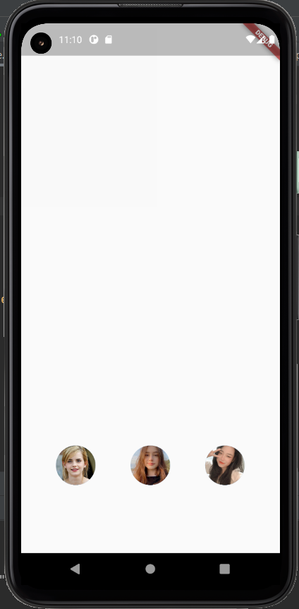

This is a simple project to give you know about HERO ANIMATIONS and the way to use it in flutter project. 

 
Want to see more detailed, please review the link: https://flutter.dev/docs/development/ui/animations/hero-animations
